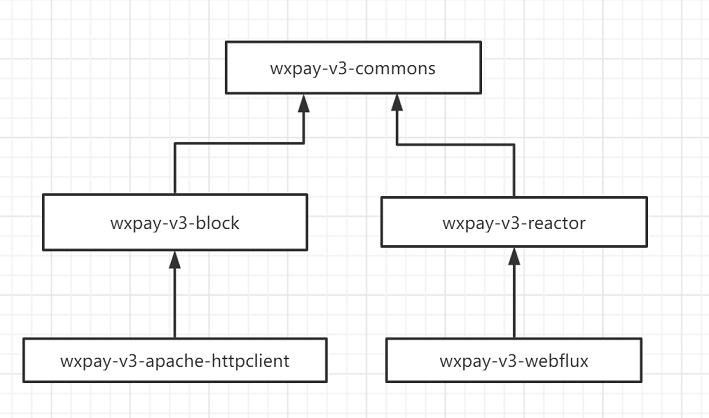

# wxpay-sdk说明
> 我们在开发微信支付时，发现微信官方已经对SDK做了升级，V3版本的SDK从设计上符合RESTful规范。 我们再在开源库中寻找是否有现成de开箱即用、并且支持响应式编程的SDK版本。经过一凡寻找，令我们失望。github上的一些微信支付SDK版本，从设计上多多少少都有一些问题，因此我们决定重新开发一套基于Java的V3版本的支付SDK， 并且用于我们的产品。


微信支付v3版本的sdk, 目前包含同步API和异步API。用户可以使用此API 版本在传统的命令式编程模式上，也可以使用异步API用于响应式编程。目前只支持微信 ==直连模式== 支付。

本SDK支持多商户模式。


[toc]


## 同步API

用于传统命令式编程。 可以用于Spring MVC 或其他框架。目前httpClient 采用Apache-httpClient。

## 异步API

同时，我们也支持了异步接口，异步实现采用Project reactor。httpClient采用Spring Webflux的WebClient。 

## 模块说明

- wxpay-v3-commons
  - 微信v3接口的公共类定义， 同步异步均继承这个类，抽象了一些支付需要的公共方法和类放在这个模块中。
- wxpay-v3-reactor
  - 微信v3的SDK, 基于ProjectReactor 封装了一些接口，和实现了一些API。本模块不依赖于Spring， 可以不在spring环境下使用。
- wxpay-v3-webflux
  - 微信v3的SDK, 基于webflux来实现。 适用于spring环境。 用户可以用于异步或同步模式。 签名函数在拦截器中实现。
- wxpay-v3-block 
  
  - 基于命令式编程，封装了一些支付接口和实现了一些API。 本模块不依赖于其他框架，可以使用在任何java环境下。
- wxpay-v3-apache-httpclient
  - 基于apache httpClient而实现的的版本。

**模块之间的依赖关系**(如果不想使用本SDK封装的接口，用户可以依赖wxpay-v3-commons模块自己封装API)




**同步接口请使用 wxpay-v3-apache-httpclient。**

**异步接口请使用wxpay-v3-webflux。**


## 实现的API

**注意： 目前只实现了直连模式API**

直连模式API描述

| 类型     | API名称                 | 支持同步 | 支持异步 | 说明                                 |
| -------- | ----------------------- | -------- | -------- | ------------------------------------ |
| 预下单   | AppPrepay               | 是       | 是       | APP下单API                           |
| 预下单   | H5Prepay                | 是       | 是       | H5下单API                            |
| 预下单   | JSApiPrepay             | 是       | 是       | JSAPI下单API                         |
| 预下单   | NativePrepay            | 是       | 是       | Native下单API                        |
| 订单查询 | OrderTradeNoInquiry     | 是       | 是       | 通过商户订单号查询                   |
| 订单查询 | OrderTransactionInquiry | 是       | 是       | 通过微信支付订单号查询               |
| 订单查询 | OrderInquiry            | 是       | 是       | 通过商户订单号或者微信支付订单号查询 |
| 订单关闭 | OrderClosure            | 是       | 是       | 订单关闭                             |
| 证书下载 | CertificatesDownloader  | 是       | 是       | 微信证书下载                         |


# 注意

- 该模块只支持微信v3版本的SDK. 其他v1, v2版本不支持。 
- 对于JSON的解析，本SDK 依赖于Gson来解析。


# 使用方法

## 同步接口

### 使用步骤

1. 构建ApiContext.
2. 构建对象调用接口

### 构建ApiContext示例代码

```java
// 注意导入的是同步的包。
import com.jk.wxpay.v3.apache.MemoryCacheCertificatesManager;
import com.jk.wxpay.v3.apache.SimpleMerchantPrivateKeyManager;
import com.jk.wxpay.v3.apache.http.ApiContextBuilder;
import com.jk.wxpay.v3.block.api.direct.OrderClosure;
import com.jk.wxpay.v3.block.api.direct.prepay.AppPrepay;
import com.jk.wxpay.v3.block.api.direct.prepay.JsApiPrepay;
import com.jk.wxpay.v3.block.api.direct.prepay.NativePrepay;
import com.jk.wxpay.v3.block.request.ApiContext;
import com.jk.wxpay.v3.commons.bean.direct.JSAPIPrepayOrder;
import com.jk.wxpay.v3.commons.bean.direct.PrepayOrder;
import com.jk.wxpay.v3.commons.bean.direct.result.NativePrepayResult;
import com.jk.wxpay.v3.commons.bean.direct.result.PrepayResult;
import com.jk.wxpay.v3.commons.exception.WxErrorException;

private ApiContext init() {
    
    // 构建商户私钥管理器， 一个简单的管理。
    SimpleMerchantPrivateKeyManager privateKeyManager = new SimpleMerchantPrivateKeyManager()
        .setCertSerialNumber("xxxxx")    // 商户证书编号。
        .setPrivateKeyPath("cert/my-cert-key.pem")  // 账户私钥文件
        .setApiV3Key("xxxxxx");   // 商户在微信商户平台上的apiV3key。
	
    // 构建微信证书管理器， 这个管理器默认证书自动下载，且存储在内存中。
    MemoryCacheCertificatesManager certificatesManager = new MemoryCacheCertificatesManager(privateKeyManager);
	
    // 构建apiContext.
    ApiContext apiContext = new ApiContextBuilder().setMerchantPrivateKeyManager(privateKeyManager)
        .setWxCertificatesManager(certificatesManager).build();
    return apiContext;
}
```

### 调用下单接口

```java
// App下载支付
try {
    AppPrepay appPrepay  = new AppPrepay(this.apiContext);
    PrepayResult result = appPrepay.prepay(new PrepayOrder()
                                           .setMchId("xxx")
                                           .setAppId("xx").setOutTradeNo("xxxxxxxx"));
    System.out.println(result);
} catch (WxErrorException e) {
    e.printStackTrace();
}


// Native下单支付
try {
    NativePrepay nativePrepay = new NativePrepay(this.apiContext);
    NativePrepayResult result = nativePrepay.prepay(new PrepayOrder()
                                                    .setMchId("xxx")
                                                    .setAppId("xx").setOutTradeNo("xxxxxxxx"));
    System.out.println(result);
} catch (WxErrorException e) {
    e.printStackTrace();
}

// JSAPI下账单支付
try {
    JsApiPrepay jsApiPrepay = new JsApiPrepay(this.apiContext);
    JSAPIPrepayOrder prepayOrder = new JSAPIPrepayOrder();
    prepayOrder.setMchId("xxx").setAppId("111");
    PrepayResult result = jsApiPrepay.prepay(prepayOrder);
    System.out.println(result);
} catch (WxErrorException e) {
    e.printStackTrace();
}

// ........其他支付接口不再掩饰。
```


### 关闭订单

```java
// 调用对象直接关闭，关闭无返回值。不抛出异常说明关闭完成。
try {
    new OrderClosure(this.apiContext)
        .close("merchantId", "outTradeNo");
} catch (WxErrorException e) {
    e.printStackTrace();
}
```

### 查询订单

```java
// 支持按照商户订单号查询或者微信交易号查询。
try {
    OrderInquiry orderInquiry = new OrderInquiry(this.apiContext);
    OrderQueryResult orderQueryResult1 = orderInquiry.queryByOutTradeNo("mchId", "outTradeNo");
    OrderQueryResult orderQueryResult2 = orderInquiry.queryByWechatTransactionId("mchId", "transactionId");

} catch (WxErrorException e) {
    e.printStackTrace();
}
        

```


## 异步接口

### 使用步骤

1. 构建ApiContext.
2. 构建对象调用接口

### 构建ApiContext示例代码

```java
// 注意导入的是异步的包。
import com.jk.wxpay.v3.reactor.api.direct.OrderClosure;
import com.jk.wxpay.v3.reactor.api.direct.prepay.JsApiPrepay;
import com.jk.wxpay.v3.reactor.api.direct.prepay.NativePrepay;
import com.jk.wxpay.v3.commons.bean.direct.JSAPIPrepayOrder;
import com.jk.wxpay.v3.commons.bean.direct.PrepayOrder;
import com.jk.wxpay.v3.flux.MemoryCacheCertificatesManager;
import com.jk.wxpay.v3.flux.SimpleMerchantPrivateKeyManager;
import com.jk.wxpay.v3.flux.http.ApiContextBuilder;
import com.jk.wxpay.v3.reactor.api.direct.prepay.AppPrepay;
import com.jk.wxpay.v3.reactor.api.direct.query.OrderInquiry;
import com.jk.wxpay.v3.reactor.request.ApiContext;
// 类名基本相同。
private ApiContext init() {
    
    // 构建商户私钥管理器， 一个简单的管理。
    SimpleMerchantPrivateKeyManager privateKeyManager = new SimpleMerchantPrivateKeyManager()
        .setCertSerialNumber("xxxxx")    // 商户证书编号。
        .setPrivateKeyPath("cert/my-cert-key.pem")  // 账户私钥文件
        .setApiV3Key("xxxxxx");   // 商户在微信商户平台上的apiV3key。
	
    // 构建微信证书管理器， 这个管理器默认证书自动下载，且存储在内存中。
    MemoryCacheCertificatesManager certificatesManager = new MemoryCacheCertificatesManager(privateKeyManager);
	
    // 构建apiContext.
    ApiContext apiContext = new ApiContextBuilder().setMerchantPrivateKeyManager(privateKeyManager)
        .setWxCertificatesManager(certificatesManager).build();
    return apiContext;
}
```

### 调用下单接口

```java
// App下载支付
AppPrepay appPrepay  = new AppPrepay(this.apiContext);
PrepayOrder prepayOrder = new PrepayOrder()
    .setMchId("xxx")
    .setAppId("xx")
    .setOutTradeNo("xxxxxxxx");
appPrepay.prepay(prepayOrder).subscribe(result -> {
    // do something.
}, e -> System.out.println());


// Native下单支付
NativePrepay nativePrepay = new NativePrepay(this.apiContext);
PrepayOrder prepayOrder = new PrepayOrder()
    .setMchId("xxx")
    .setAppId("xx")
    .setOutTradeNo("xxxxxxxx");
nativePrepay.prepay(prepayOrder).subscribe(result -> {
    // do something.
}, e -> System.out.println());

// JSAPI下账单支付
JsApiPrepay jsApiPrepay = new JsApiPrepay(this.apiContext);
JSAPIPrepayOrder prepayOrder = new JSAPIPrepayOrder();
prepayOrder.setMchId("xxx").setAppId("111");
jsApiPrepay.prepay(prepayOrder).subscribe(result -> {
    // do something.
}, e -> System.out.println());

// ........其他支付接口不再掩饰。
```


### 关闭订单

```java
OrderClosure orderClosure = new OrderClosure(this.apiContext);
orderClosure.close("merchantId", "outTradeNo").subscribe((v) -> {
    // do something.
}, e -> System.out.println());
```

### 查询订单

```java
// 支持按照商户订单号查询或者微信交易号查询。
OrderInquiry orderInquiry = new OrderInquiry(this.apiContext);
orderInquiry.queryByOutTradeNo("mchId", "outTradeNo").subscribe(result -> {
    // do something.
}, e -> System.out.println());

orderInquiry.queryByWechatTransactionId("mchId", "transactionId").subscribe(result -> {
    // do something.
}, e -> System.out.println());
        

```


##  证书管理

提供了两个简单的私钥和证书管理器的接口， 用户可根据实际应用场景实现这两个接口，并初始化SDK。 

```java

// 商户私钥管理器接口。用于管理商户的私钥。
MerchantPrivateKeyManager
// 商户对应的微信端证书管理器接口。     
WxCertificatesManager
    
    
```

我们提供了两个简单的管理器

```java
MemoryCacheCertificatesManager   // 自动更新证书管理器，更新证书存储在内存中
SimpleMerchantPrivateKeyManager  // 简单的商户私钥服务，从resource 中初始化。
```


# 帮助


# roadmap
1. 后续支持服务商模式。
